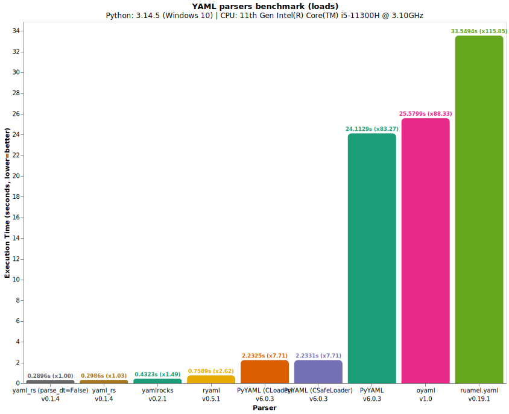
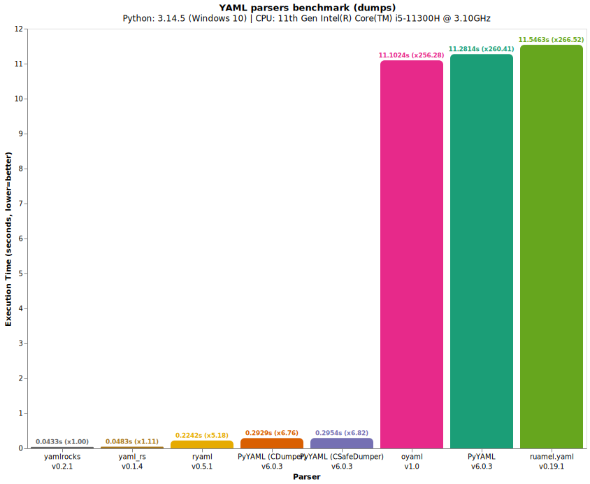

# To run the benchmarks

## Create and activate virtual environment

<p>
  
  Linux /
  
  MacOS:
</p>

```bash
python3 -m venv .venv
source .venv/bin/activate
```

<p>
  
  Windows:
</p>

```bash
py -m venv .venv
.venv\scripts\activate
```

## Install benchmark dependencies

<p>
  
  Using <a href="https://github.com/pypa/pip">pip</a>:
</p>

```bash
pip install . --group bench
```

<p>
  
  Using <a href="https://github.com/astral-sh/uv">uv</a>:
</p>

```bash
uv pip install . --group bench
```

## Run `benchmark/run.py`

```bash
python benchmark/run.py
```

## Results

### loads



### dumps


